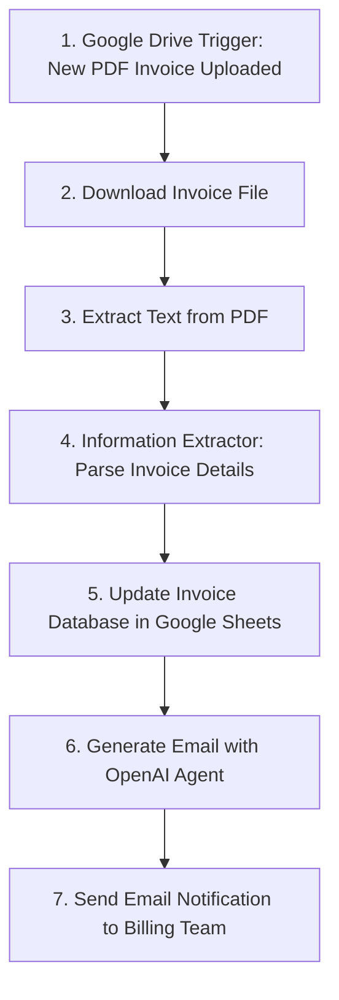

# 📌 Purchase Invoice Workflow: Automating PDF Invoices with AI & n8n  

  
  
  
  
  

---

## 📖 Project Overview  
This project demonstrates how to **automate purchase invoice processing** using **AI + n8n + Google Workspace**.  
The workflow automatically extracts key details from **PDF invoices** uploaded to Google Drive, appends them into a **Google Sheets Invoice Database**, and sends an **email notification** to the billing team.  

No manual data entry, no missed invoices — everything is automated end-to-end! 🚀  

---

## 🎯 Benefits of the Project  
- ✔️ **Time-Saving** – Automates invoice entry & notifications  
- ✔️ **Error Reduction** – AI ensures consistent data extraction  
- ✔️ **Centralized Records** – All invoices stored in Google Sheets DB  
- ✔️ **Real-Time Notifications** – Billing team is alerted instantly  
- ✔️ **Scalable** – Easily extendable to multiple companies/vendors

---

## 🖼️ Workflow Image  
  

---

## 📊 Automated Invoice Workflow Wireframe  

After automation, the **end-to-end workflow** looks like this:  


---
## ⚙️ Workflow Steps  

### **Step 1: Google Drive Trigger**  
- **Trigger On:** New file created in `INVOICE AIS` folder  
- **Mode:** Poll every 1 minute  
- **File Type:** PDF Invoice  
- **Output:** File ID & metadata  

---

### **Step 2: Download File**  
- **Operation:** Download binary file from Google Drive  
- **File By ID:** `{{ $json.id }}`  

---

### **Step 3: Extract Text from PDF**  
- **Operation:** Extract text from binary PDF  
- **Binary Field:** `data`  

---

### **Step 4: Information Extractor (AI Schema Mapping)**  
- **Text Input:** `{{ $json.text }}`  
- **Schema Extracted:**  
  - Invoice No  
  - Client Name  
  - Client Email (must contain `@`, else return `Not Available`)  
  - Client Address  
  - Client Phone  
  - Total Amount  
  - Invoice Date  
  - Due Date  

**Example Output:**  
```yaml
Invoice No: BPXINV-00550
Client Name: Roger Bigot
Client Email: Not Available
Client Address: 4 Rue des Cites Aubervilliers, Seine-Saint-Denis, 93300
Client Phone: +33 148 340990
Total Amount: 6610.95
Invoice Date: 23.05.2021
Due Date: None
```

### **Step 5: Update Invoice Database (Google Sheets)**  
- **Operation:** Append Row  
- **Sheet:** `Sheet1` inside `1.4 Invoice Update DB AIS`  
- **Columns Appended:**  
  - Invoice No  
  - Client Name  
  - Client Email  
  - Client Address  
  - Client Phone  
  - Total Amount  
  - Invoice Date  
  - Due Date  

---

### **Step 6: Generate Email (OpenAI Agent)**  
**System Prompt:** 
```
## Overview
You are an email expert for Green Grass Corp (Greenland). 
You will receive invoice information. 
Your job is to notify the internal billing team that an invoice was received/sent.

## Email 
Inform the billing team of the invoice. 
Let them know that we have also updated this in the Invoice Database, and they can view it here:
https://docs.google.com/spreadsheets/d/1HPR7hr4LysBYJ1o_LSrD4i_6yepojkGZzMch-pIoxXo/edit?gid=0#gid=0

## Output
Output the following parameters separately:
- Subject 
- Email
```
----

### **Step 7: Send Email (Gmail)**  
- **To:** Billing Team (example: `sachinsavkare08@outlook.com`)  
- **Subject:** From OpenAI agent output  
- **Body:** From OpenAI agent output  

---

## 📂 Free Template  
We’ve made this workflow **available as a free n8n template** 🎁.  
You can import it directly into your n8n instance and start automating your invoices today!  

👉 [Download Template Here](https://github.com/SachinSavkare/Purchase-Invoice-Workflow-Automating-PDF-Invoices-with-AI-n8n/blob/main/1.4%20Invoice%20Workflow%20(Bonus).json)  

---

✨ With this workflow, you can move from **manual invoice processing → fully automated billing system** in just a few steps.  

